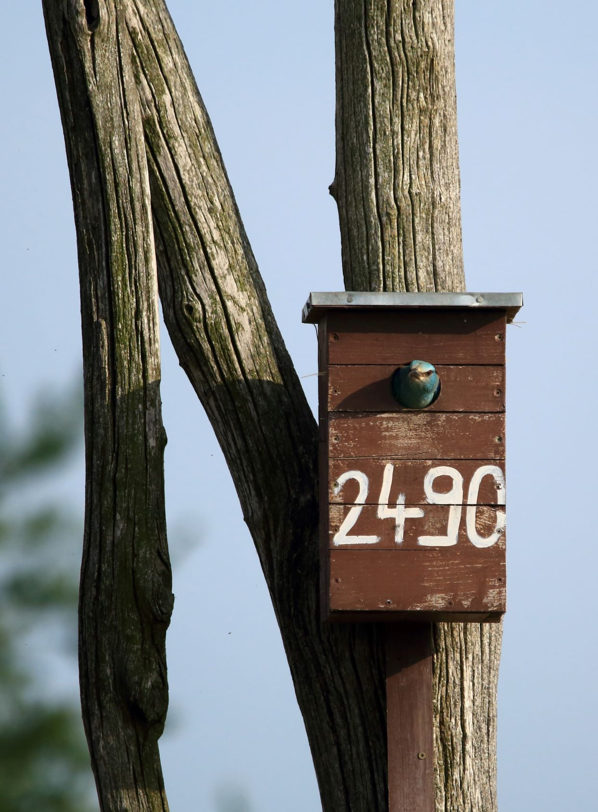

# Roller Nest Boxes
Utolsó módosítás: 2022-06-20

Andy Morffew [CC-BY-2.0](https://commons.wikimedia.org/wiki/Category:CC-BY-2.0)

Az alkalmazás célja a szalakóta odúk nyilvántartásának kezelése, valamint a terepen gyűjtött információk
rendszerezése. Az elmúlt évek során kiforrott kihelyezési és ellenőrzési stratégia adminisztrációjának
egyszerűsítése mellett a gyakori hibákra tartalmaz validációkat. Az eddigi adatelemzések folyamatos
naprakész megvalósítását API hívásokon keresztül is támogatja, illetve lehetővé teszi az adatok egyszerű
integrálását a meglévő adattároló rendszerekben (Biotika).

Az alkalmazás API felületén keresztül lehet feltölteni az új odúkihelyezéseket, valamint a költések
ellenőrzése során gyűjtött adatokat.

_A dokumentációban szereplő, alkalmazás által biztosított URL-ek helyi gépen történő futtatás esetén
érvényesek. A 'http://localhost:8080' rész helyett mindig az aktuális kiszolgáló URL-jét és a
megfelelő portszámot kell behelyettesíteni._

## Entitások

### Odú (NestBox)

Feladata a kihelyezett odúkkal kapcsolatos aktuális információk kezelése, tárolása.

Az adatbázisban alkalmazott elvárások az egyes attribútumokkal kapcsolatban:

* nest_box_id: primary key, auto increment, not null
* nest_box_number: unique, not null,
* eov_x: not null,
* eov_y: not null

A json állományokban előforduló kifejezések magyarázata:

- nestBoxNumber: az odúra festett azonosító
- coordinates: földrajzi koordináták HD72/EOV (EPSG:23700) projekcióban
  - eovX: x koordináta
  - eovY: y koordináta
- direction: az odú bejáratának iránya égtájak szerint
- height: az odú helyének magassága a földfelszíntől, méterben

| HTTP metódus | Végpont               | Leírás                                                              |
|--------------|-----------------------|---------------------------------------------------------------------|
| GET          | `/api/nest-boxes/all` | lekérdezi az összes odút, visszaadja egy listában                   |
| GET          | `/api/nest-boxes`     | lekérdez egy odút `nestBoxNumber` alapján                           |
| POST         | `/api/nest-boxes`     | létrehoz egy odút                                                   |
| PUT          | `/api/nest-boxes`     | frissít egy odút `nestBoxNumber` alapján, a megadott paraméterekkel |
| DELETE       | `/api/nest-boxes`     | töröl egy odút `nestBoxNumber` alapján                              |

Példa URL, bean validáció és mintaadatok az egyes végpontokon:

`/api/nest-boxes/all` (GET):

GET http://localhost:8080/api/nest-boxes/all

accept:

    [
    {
    "nestBoxNumber": "1600",
    "coordinates": {
    "eovX": 764872,
    "eovY": 271458
    },
    "direction": "SW",
    "height": 9.5
    },
    {
    "nestBoxNumber": "1485",
    "coordinates": {
    "eovX": 758615,
    "eovY": 257498
    },
    "direction": "N",
    "height": 3.5
    }
    ]

Response code: 200

`/api/nest-boxes` (GET):

GET http://localhost:8080/api/nest-boxes?nest-box-number=1600

- nestBoxNumber: az odúra festett azonosító
- coordinates: földrajzi koordináták HD72/EOV (EPSG:23700) projekcióban
  - eovX: x koordináta
  - eovY: y koordináta
- direction: az odú bejáratának iránya égtájak szerint
- height: az odú helyének magassága a földfelszíntől, méterben

accept:

    {
    "nestBoxNumber": "1600",
    "coordinates": {
    "eovX": 764872,
    "eovY": 271458
    },
    "direction": "SW",
    "height": 9.5
    }

Response code: 200

`/api/nest-boxes` (POST):

POST http://localhost:8080/api/nest-boxes

A koordinátákon lévő korlátozások miatt odút rögzíteni csak Magyarországot befoglaló téglalapon belül lehet.
Az újonnan felvett odú száma nem szerepelhet az adatbázisban. Odút csak 1 és 10 méter közötti magasságban
lehet kihelyezni.

nestBoxNumber:
- egyedi (adatbázisban nem szerepelhet),
- nem lehet üres és null

eovX:
- minimum érték: 426400
- maximum érték: 937500
- nem lehet null

eovY:
- minimum érték: 43000
- maximum érték: 361400
- nem lehet null

direction:
- a Quarter enum valamely értékét veheti fel: N, NE, E, SE, S, SW, W, NW
- lehet null

height:
- minimum érték: 1
- maximum érték 10
- nem lehet null

content:

    {
    "nestBoxNumber": "1485",
    "coordinatesCommand": {
    "eovX": 758615,
    "eovY": 257498
    },
    "direction": "N",
    "height": 3.5
    }

accept:

    {
    "nestBoxNumber": "1485",
    "coordinates": {
    "eovX": 758615,
    "eovY": 257498
    },
    "direction": "N",
    "height": 3.5
    }

Response code: 201

`/api/nest-boxes` (PUT):

PUT http://localhost:8080/api/nest-boxes

Amennyiben az odút az adott odútartón (fa, oszlop) másik helyre tesszük át, lehetőség van frissíteni az odú
adatait. Ekkor változhat az odú tájolása és magassága, ezeket a kihelyezésre vonatkozó szabályok betartásával
lehet módosítani az adatbázisban.

nestBoxNumber:
- egyedi (adatbázisban nem szerepelhet),
- nem lehet üres és null

direction:
- a Quarter enum valamely értékét veheti fel: N, NE, E, SE, S, SW, W, NW
- lehet null

height:
- minimum érték: 1
- maximum érték 10
- nem lehet null

content:

    {
    "nestBoxNumber": "1600",
    "direction": "NE",
    "height": 6.5
    }

accept:

    {
    "nestBoxNumber": "1600",
    "coordinates": {
    "eovX": 764872,
    "eovY": 271458
    },
    "direction": "NE",
    "height": 6.5
    }

Response code: 200

`/api/nest-boxes` (DELETE):

DELETE http://localhost:8080/api/nest-boxes?nest-box-number=1600

Nem lehet törölni olyan odút, amelyhez fészkelések tartoznak.  
Nem ad vissza semmilyen adatot.

Response code: 204

### Fészkelés (Nest)

Az egyes odúkban regisztrált fészkelések adatainak kezeléséért felelős.

Az adatbázisban alkalmazott elvárások az egyes attribútumokkal kapcsolatban:

* nest_id: primary key, auto increment, not null
* nest_box_id: foreign key, not null
* date_of_survey: not null
* observer: not null

A json állományokban előforduló kifejezések magyarázata:  
_(Az odúknál is szereplő változók magyarázatát ld. ott.)_

dateOfSurvey: a terepi adatgyűjtés dátuma
species: a fészkelő faj tudományos neve
numberOfNestlings: tojások és/vagy fiókák száma
observer: terepi adatgyűjtő neve
quantity: a szaporulat (tojás és fióka) összesen
unitOfQuantity: mennyiség egysége, a projekt esetében mindig "egyedszám"
activity: a faj aktivitása, a projekt esetében mindig "fióka fészekben"
surveyMethod: felmérési módazertan a projekt esetében mindig "szalakóta odúellenőrzés"
collectionMethod: gyűjtési mód, a projekt esetében mindig "vizuális"

| HTTP metódus | Végpont             | Leírás                                                                                      |
|--------------|---------------------|---------------------------------------------------------------------------------------------|
| GET          | `/api/nests`        | lekérdezi az összes fészkelést, illetve odúszám és/vagy költő faj szerint szűr              |
| GET          | `/api/zoology-data` | lekérdezi az összes fészkelést, a zoológiai adatbázisnak megfelelő formátumban adja vissza  |
| POST         | `/api/nests`        | létrehoz egy fészkelést terepen gyűjtött adatok alapján                                     |                                                 |

Példa URL, bean validáció és mintaadatok az egyes végpontokon:

`/api/nests` (GET):

Összes fészkelés lekérdezése:

GET http://localhost:8080/api/nests

accept:

    [
    {
    "nestBoxNumber": "1485",
    "coordinates": {
    "eovX": 758615,
    "eovY": 257498
    },
    "dateOfSurvey": "2015-06-18",
    "species": "Corvus monedula",
    "numberOfNestlings": 4,
    "observer": "John Doe"
    },
    {
    "nestBoxNumber": "1485",
    "coordinates": {
    "eovX": 758615,
    "eovY": 257498
    },
    "dateOfSurvey": "2022-06-18",
    "species": "Coracias garrulus",
    "numberOfNestlings": 4,
    "observer": "John Doe"
    }
    ]

Response code: 200

Fészkelések odúszám alapján szűrve (nagybetű érzékeny):

GET http://localhost:8080/api/nests?nest-box-number=1485
accept:

    [
    {
    "nestBoxNumber": "1485",
    "coordinates": {
    "eovX": 758615,
    "eovY": 257498
    },
    "dateOfSurvey": "2015-06-18",
    "species": "Corvus monedula",
    "numberOfNestlings": 4,
    "observer": "John Doe"
    },
    {
    "nestBoxNumber": "1485",
    "coordinates": {
    "eovX": 758615,
    "eovY": 257498
    },
    "dateOfSurvey": "2022-06-18",
    "species": "Coracias garrulus",
    "numberOfNestlings": 4,
    "observer": "John Doe"
    }
    ]

Response code: 200

Fészkelések fajnév vagy annak egy részlete alapján szűrve (nem nagybetű érzékeny):

GET http://localhost:8080/api/nests?species=Corvus%20monedula

    [
    {
    "nestBoxNumber": "1485",
    "coordinates": {
    "eovX": 758615,
    "eovY": 257498
    },
    "dateOfSurvey": "2015-06-18",
    "species": "Corvus monedula",
    "numberOfNestlings": 4,
    "observer": "John Doe"
    },
    {
    "nestBoxNumber": "1600",
    "coordinates": {
    "eovX": 758615,
    "eovY": 257498
    },
    "dateOfSurvey": "2015-06-18",
    "species": "Corvus monedula",
    "numberOfNestlings": 4,
    "observer": "John Doe"
    }
    ]

Response code: 200

Fészkelések odúszám és fajnév vagy annak egy részlete alapján szűrve:

A fenti két szűrő kombinálása, az odúszám keresője nagybetű-érzékeny, míg a fajnév keresője nem az.

GET http://localhost:8080/api/nests?nest-box-number=1485&species=Corvus%20monedula

    [
    {
    "nestBoxNumber": "1485",
    "coordinates": {
    "eovX": 758615,
    "eovY": 257498
    },
    "dateOfSurvey": "2022-06-18",
    "species": "Coracias garrulus",
    "numberOfNestlings": 4,
    "observer": "John Doe"
    },
    {
    "nestBoxNumber": "1485",
    "coordinates": {
    "eovX": 758615,
    "eovY": 257498
    },
    "dateOfSurvey": "2019-06-18",
    "species": "Coracias garrulus",
    "numberOfNestlings": 4,
    "observer": "John Doe"
    }
    ]

Response code: 200

`/api/zoology-data` (GET)

GET http://localhost:8080/api/nests/zoology-data

    [
    {
    "dateOfSurvey": "2019-06-18",
    "coordinates": {
    "eovX": 758615,
    "eovY": 257498
    },
    "species": "Coracias garrulus",
    "quantity": 4,
    "unitOfQuantity": "individual",
    "activity": "Nestling in nest",
    "surveyMethod": "Nest box control",
    "collectionMethod": "visual",
    "observer": "John Doe"
    },
    {
    "dateOfSurvey": "2015-06-18",
    "coordinates": {
    "eovX": 758615,
    "eovY": 257498
    },
    "species": "Corvus monedula",
    "quantity": 4,
    "unitOfQuantity": "individual",
    "activity": "Nestling in nest",
    "surveyMethod": "Nest box control",
    "collectionMethod": "visual",
    "observer": "John Doe"
    }
    ]

Response code: 200

`/api/nests` (POST):

POST http://localhost:8080/api/nests

Nem tölthető fel olyan fészkelés, ahol az odúszám, a dátum és az adatközlő kombinációja megegyezik egy,
már az adatbázisban szereplő rekorddal.  
A fészkelési adathoz tartozó odúszámnak szerepelni kell az adatbázisban.  
A dátum nem lehet a jövőben és nem lehet üres.  
A fajnév hossza minimum 5, maximum 45 karakter lehet, de lehet üres abban az esetben, ha az ellenőrzés során  
megállapítható, hogy nem volt költés az odúban.  
A fiókák és/vagy tojások összege nem lehet negatív és nem lehet több, mint 20.
Az adatközlő nem lehet üres, és a névnek minimum 5, maximum 100 karakterből kell állnia.

nestBoxNumber (odúszám):
- léteznie kell az adatbázisban
- nem lehet üres és null

dateOfSurvey (adatgyűjtés dátuma):
- nem lehet jövőbeli
- nem lehet null

species (fészkelő faj):
- minimum 5 karakter hosszú
- maximum 45 karakter hosszú
- lehet null

numberOfNestlings (tojások és/vagy fiókák száma):
- pozitív vagy nulla értéket vehet fel
- maximum 20

observer (adatközlő):
- nem lehet üres és null
- minimum 5 karakter hosszú
- maximum 100 karakter hosszú

content:

    {
    "nestBoxNumber": "1485",
    "dateOfSurvey": "2022-06-18",
    "species": "Coracias garrulus",
    "numberOfNestlings": 4,
    "observer": "John Doe"
    }

accept:

    {
    "nestBoxNumber": "1485",
    "coordinates": {
    "eovX": 758615,
    "eovY": 257498
    },
    "dateOfSurvey": "2015-06-18",
    "species": "Corvus monedula",
    "numberOfNestlings": 4,
    "observer": "John Doe"
    }

Response code: 201

## Alkalmazott technológiák

Az alkalmazás egy tipikus három rétegű alkalmazás, amely két controller rétegen keresztül valósítja meg a
kommunikációt. Az innen érkező adatok egyetlen service rétegben találkoznak, ahol az üzleti logika valósul
meg. A két entitás önálló repository rétegeken keresztül csatlakozik a MariaDB adatbázishoz.

A középső, service réteg az alábbi funkciókat tartalmazza:

- Konvertálás az entitások és a dto-k között.
- Beérkezett odúszám ellenőrzése az adatbázisban:
  - Odú kihelyezésénél nem kerülhet be odú már meglévő számmal.
  - Odú adatainak módosításánál, fészkelés regisztrálásakor az odúszámnak szerepelnie kell az adatbázisban.
- Ellenőrzi egy beérkezett fészkelési adat rögzítését megelőzően, hogy az odúnál azon a napon az az adatközlő
rögzített-e már adatot. Ezáltal elkerülhető egy-egy adat többszöri rögzítése.
- Odú törlése esetén ellenőrzi, hogy az adott odúhoz rögzítettek-e már fészkelést. Amennyiben igen, az odú
törlése nem lehetséges.

### Spring keretrendszer

Az alkalmazás a Spring Boot 2.7.0 verziójával készült, a Spring keretrendszer 5.3.20-as verziójával
alkalmazva.

Fontosabb függőségek:

Production:

- Spring Boot Starter Web
- Spring Boot Starter Data JPA
- Spring Boot Starter Validation

Test:

- Spring Boot Starter Webflux
- Spring Boot Starter Test

További alkalmazott könyvtárak, alkalmazások:

- Lombok (1.18.24)
- MapStruct (1.5.1.Final)
- Zalando Problem Spring Web Starter (0.27.0)
- Tomcat server 9.0.63

### Tesztelés

A tesztesetek a JUnit 5.8.2 keretrendszeren alapulnak, de a legtöbb assert az assertJ 3.22.0 metódusait
alkalmazza. Integrációs tesztek esetén a WebFlux technológiát alkalmaztam.

### Adatbázis

Az alkalmazás az adatokat MariaDb 10.8-as verzióján futó adatbázisba menti.
Az adatbázis migrálását FlyWay 5.8.11 migrációs eszközzel valósítottam meg.

### OpenApi dokumentáció

Az API dokumentáció grafikus verziója a Swagger UI technológiát használja és az alkalmazás futtatásakor
elérhető a http://localhost:8080/swagger-ui/index.html címen. Ehhez a Springdoc OpenApi UI 1.6.9-es
verzióját használtam.

A json OpenApi dokumentum a http://localhost:8080/v3/api-docs címen érhető el, szintén az alkalmazás
futtatásakor.

A Swagger felületen keresztül kipróbálható az alkalmazás, az itt kiadott parancsok hatására a production
adatbázisban kerülnek elmentésre az adatok.

### Alkalmazás futtatása docker segítségével

A git repository klónozását követően helyben is futtatható az alkalmazás, amennyiben a docker és
docker-compose eszközök helyben rendelkezésre állnak.  
Az alkalmazás docker környezetben is futtatható. Ehhez először el kell készíteni az alkalmazás build-jét.
Ehhez, ha a Maven eszköz nem áll rendelkezésre, használható a projektben található mvnw script is. Az
`mvnw package -DskipTests` parancs használatával elkészíthetjük a szükséges állományokat.  
Ezt követően a docker mappában ki kell adni a `docker-compose up -d` parancsot. Ennek hatására három
konténer indul el. Egy a production adatbázis, amelyhez az alkalmazás  a
`jdbc:mariadb://localhost:3306/roller` hivatkozáson keresztül csatlakozik. A tesztesetek futtatásához
önálló MariaDb adatbázis áll rendelkezésre, a `jdbc:mariadb://localhost:3307/roller-test` címen. Maga az
alkalmazás alapértelmezetten docker futtatása esetén is a 8080-as porton keresztül érhető el.

