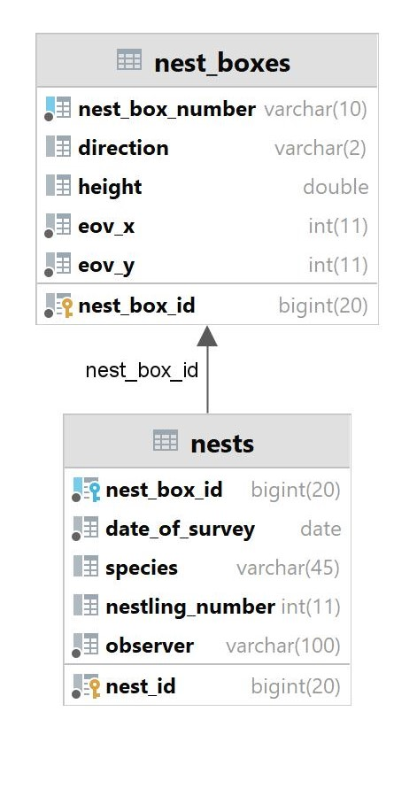

# Roller nestboxes

Az alkalmazás célja a szalakóta odúk nyilvántartásának kezelése, valamint a terepen gyűjtött információk
rendszerezése. Az elmúlt évek során kiforrt kihelyezési és ellenőrzési stratégia adminisztrációjának
egyszerűsítése mellett a gyakori hibákra tartalmaz ellenőrzési megoldásokat. Az eddigi adatelemzésekhez
tartozó lekérdezésekhez tartalmaz egyszerű megoldásokat, illetve lehetővé teszi az adatok egyszerű
integrálását a meglévő adattároló rendszerekben (Biotika, OpenBioMaps).

Az alkalmazás api felületén keresztül lehet feltölteni az új odúkihelyezéseket, az odúk karbantartása során
keletkezett információkat, valamint a költések ellenőrzése során gyűjtött adatokat.

Az alkalmazás két entitást tartalmaz:
- odú (nestbox): a kihelyezett odúkkal kapcsolatos aktuális információk kezelését valósítja meg.
- költés (nesting): az egyes odúkban lévő fészkelések adatainak kezeléséért felelős.

